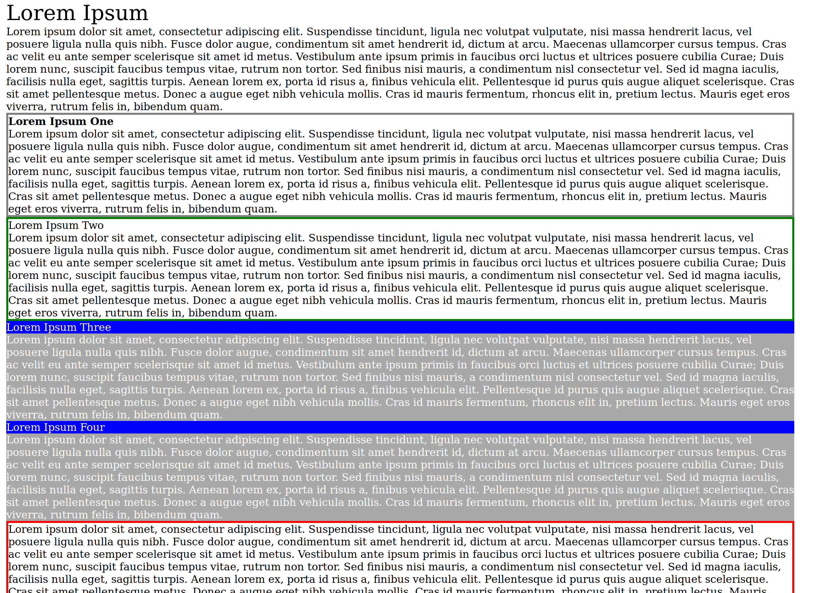

# Using the BakedStyles framework

## Beginning a design
Let's assume we have an html document in the following form:
```html
<html>
<body>
  <div class="book">
    <div class="chapter">
      <div class="page">
        <div class="title">Lorem Ipsum</div>
        Lorem ipsum...
        <div class="note type-one">
          <div class="title">Lorem Ipsum One</div>
          Lorem ipsum...
        </div>
        <div class="note type-two">
          <div class="title">Lorem Ipsum Two</div>
          Lorem ipsum...
        </div>
        <div class="note type-three">
          <div class="title">Lorem Ipsum Three</div>
          Lorem ipsum...
        </div>
        <div class="note type-four">
          <div class="title">Lorem Ipsum Four</div>
          Lorem ipsum...
        </div>
        <div class="note type-five">
          Lorem ipsum...
        </div>
      </div>
    </div>
  </div>
</body>
</html>
```

### Process

Suppose we would like the notes to have the following stylings:
- `type-one` will be given an outlined grey box and a bold title
- `type-two` will be given an outlined green box
- `type-three` will be given a blue header and dark grey background and white text
- `type-four` will match `type-three`
- `type-five` will be given an outlined red box

Let's make a couple observations about the proposed designs above:
- First, it would seem that notes of `type-one` and `type-two` follow the same HTML schema and have a similar design, but there needs to be a customization option for the box color and font weight. 
- Next, `type-three` and `type-four` are identical. 
- Finally, `type-five` would initially seem to be the same as `type-one` or `type-two`, but we can notice that the schema for `type-five` does not include a title, so using the same design shape for these two notes would be over-engineering for a note of `type-five` as well as decrease coverage, since a `.type-five > title` selector would miss.

Following from the above, let's plan to make three shapes. First, one to accommodate notes `type-one` and `type-two`. Second, one to accommodate notes `type-three` and `type-four`. Last, one to accommodate only `type-five`. We will do our best to reuse common components where possible.

Let's get started on the design by entering the cnx-recipes directory and making an SCSS file for our design.

```bash
# bash
mkdir -p ./styles/designs/example && touch ./styles/designs/example/_design.scss
```

### Schema

The schema for a shape map is as follows:
```
shape -> Map (
  _groups(Optional) -> Map ( String -> ValueSet | String ),
  _components -> List ( ...Component )
  )
)
```
with the schema for a Component being:
```
Component -> Map (
  _name -> String,
  _subselector -> String,
  _properties -> Map ( String -> ValueSet | String ),
  _components(Optional) -> List ( ...Component )
)
```

### Property values

There are four main options for the values for properties in a shape, 3 of which are represented in the `ValueSet` enum: `OPTIONAL`, `REQUIRED`, and `GROUPED`. The last option is to set the property to a specific value. Let's explain these options:

`OPTIONAL` - Use this when the property is NOT necessary to display the element as desired or when a function that returns a component needs to be able to not include the property. For example, in notes `type-one` and `type-two`, the font weight can either be set to bold in `type-one` or not used for `type-two`. 

`REQUIRED` - Pick this option when the property must be present, but also must be determined by the style author. For example, we know that notes `type-one`, `type-two`, and `type-five` are outlined the same way, but with a different color. Thus the color property must be present, but it is up to the style author as to what the color should be.

Setting the property to a specific value - Pick this option if the property must be present, and there is no variance in the property across all of its instances. Use this when the property and value for the property must be a certain way to maintain the integrity of the design. Most common for properties that define design layout, such as `display`, `position`, etc.

`GROUPED` - Pick this option if it is desired for properties to share the same values. The `_groups` key of the superset can define a key and value, the key of which is the name for the group, and the value of which is the shared property value. For example, if we were to define our note border colors separately for some reason, we could group border-left|right|top|bottom-color together to `(enum('ValueSet:::GROUPED'), note-box-color)` and in `_groups` we add the entry `note-box-color: enum('ValueSet:::REQUIRED')`

### Naming the variable

Component Variable Names are written using [Block, Element, Modifier (BEM) syntax](https://csswizardry.com/2013/01/mindbemding-getting-your-head-round-bem-syntax/). In BEM syntax, the variable name is constructed in the following fashion:

```plaintext
.block {}
.block__element {}
.block--modifier {}
```

- `.Block` represents the higher level of an abstraction or component.
- `.block__element` represents a descendent of `.block` that helps form `.block` as a whole.
- `.block--modifier` represents a different state or version of `.block`.

So given the example of `$note--boxed__container:` in the next section, the variable represents a container that is a piece of a "boxed" type note.

### Writing the componenets and shapes

Open the file we just created in your favorite editor to get started writing our design componenets and shapes. We will write our components to variables so that they can be reused.
```scss
// _design.scss
$Note--Boxed__Container: (
  _name: 'container',
  _subselector: '.note',
  _properties: (
    border-color: enum('ValueSet:::REQUIRED'),
    border-style: solid
  )
);
$Note--Boxed__Title: (
  _name: 'title',
  _subselector: ' > .title',
  _properties: (
    font-weight: enum('ValueSet:::OPTIONAL')
  )
);
$Note--Background__Container: (
  _name: 'container',
  _subselector: '.note',
  _properties: (
    color: (enum('ValueSet:::OPTIONAL'), white),
    background-color: enum('ValueSet:::REQUIRED')
  )
);
$Note--Background__Title: (
  _name: 'title',
  _subselector: ' > .title',
  _properties: (
    color: (enum('ValueSet:::OPTIONAL'), white),
    background-color: (enum('ValueSet:::OPTIONAL'), blue)
  )
);
```

Next, let's create shapes from these components using the framework provided mixin `create_shape`.

```scss
// _design.scss

// ...variables above

// type-one, type-two
@include create_shape('BoxedNoteTitled', (
  _components: (
    map-merge($boxed_note_container, (
      _components: (
        $Note--Boxed__Title
      )
    ))
  )
));

// type-three, type-four
@include create_shape('BgNote', (
  _components: (
    map-merge($Note--Background__Container, (
      _components: (
        $Note--Background__Title
      )
    ))
  )
));

// type-five
@include create_shape('BoxedNote', (
  _components: (
    $Note--Boxed__Container
  )
));

// For the page title, a simpler shape with a default
@include create_shape('PageTitle', (
  _components: (
    _name: 'container',
    _subselector: ' > .title',
    _properties: (
      font-size: (enum('ValueSet:::OPTIONAL'), 2em)
    )
  )
));
```

That's it! We've now created a basic design to style the given HTML markup!

## Writing a style
This framework is set up so that style authors can use the SCSS compiler to help guide them through building a style. Keep that in mind when authoring.

Start by entering the cnx-recipes directory. Make a book.scss file for the book you would like a style for. Let's call this accounting as an example.
```bash
# bash
mkdir -p ./styles/books/accounting && touch ./styles/books/accounting/book.scss
```

In the blank book.scss file, let's import our framework and the design we have just created.
```scss
// book.scss
@import 'framework/framework';
@import 'design/example/design';
```

Let's try to build our new book.scss. If there is an entry added to books.txt for your book style you can use
```bash
# bash
./script/build-styles accounting # This will output css in the ./styles/output directory
```
otherwise, you can call the build script directly whilst specifying a platform
```bash
# bash
PLATFORM=pdf node ./styles/build/build.js ./styles/books/accounting/book.scss # This will output css to stdout
```

Importing only the framework should have yielded an empty stylesheet.
Let's move on to implementing our designs in our book. We do this by calling the framework provided mixin `use`. `use` takes two arguments. The first is an identifier for the authors use (i.e. it can be anything you want), and the second is the name of a defined shape or subshape in the a design.

```scss
// book.scss

// ...imports above

@include use('TypeOne', 'BoxedNoteTitled');
@include use('TypeTwo', 'BoxedNoteTitled');
@include use('TypeThreeFour', 'BgNote'); // Types three and four are EXACTLY the same, so we can have one `use` for both
@include use('TypeFive', 'BoxedNote');
@include use('PageTitleImpl', 'PageTitle');
```

Now that we've specified what designs we would like to use, let's try to build and see what happens.

```bash
PLATFORM=pdf node ./styles/build/build.js ./styles/books/accounting/book.scss
# => Error: Error [ENUM__Error:::INDEX_ERROR]: Unknown setting `TypeOne:::_selectors`.
```

We got an error. The framework has told us we need to specify selectors in our settings. This is a good opportunity to go over how settings work.

### Settings

To add settings, we can call the framework provided mixin `add_settings`. `add_settings` takes a variable number of arguments, but each must be a map of settings. Settings can be defined in the `book.scss` file or in the `/design-settings` directory. 

Conventionally we only put settings in the book file if the value of a property varies across books in a design/theme, ie. color. But for this tutorial, we will add all settings to the `book.scss` file. Let's call the `add_settings` mixin to resolve the compiler error we received earlier.

```scss
// book.scss

// ...imports above

@include add_settings((
  'TypeOne:::_selectors': (
    ".page > .type-one"
  )
));

// ...uses below
```

This is sufficient to remove the previous error, but now we get a new one:
```bash
PLATFORM=pdf node ./styles/build/build.js ./styles/books/accounting/book.scss
# => Error: Error [ENUM__Error:::INDEX_ERROR]: Unknown setting `TypeOne:::container:::border-color`.
```

Let's resolve it the same way, by adding to our settings.
```scss
// book.scss

// ...imports above

@include add_settings((
  'TypeOne:::_selectors': (
    ".page > .type-one"
  ),
  'TypeOne:::container:::border-color': grey,
));

// Or alternatively, using nested syntax for settings:
@include add_settings((
  TypeOne: (
    _selectors: (".page > .type-one"),
    'container:::border-color': grey,
  )
));
// Anytime you have a namespace indicator `:::` in your settings file, you can choose to use the nested syntax instead.

// ...uses below
```

This is sufficient to remove the previous error, but a new one arises again. Let's skip ahead to the point where we have resolved each error after a series of failed compilations to the point where we get a successful one. The final result should be:
```scss
// book.scss

// ...imports above

@include add_settings((
  TypeOne: (
    _selectors: (".page > .type-one"),
    container: (
      border-color: grey,
    )
  ),
  TypeTwo: (
    _selectors: (".page > .type-two"),
    container: (
      border-color: green,
    )
  ),
  TypeThreeFour: (
    _selectors: (".page > .type-three", ".page > .type-four"),
    container: (
      background-color: darkgrey,
    ),
    title: (
      background-color: blue,
    )
  ),
  TypeFive: (
    _selectors: (".page > .type-five"),
    container: (
      border-color: red,
    )
  ),
  PageTitleImpl: (
    _selectors: (".page"),
  )
));

// ...uses below
```

### Finishing up

The preceding book file will yield some CSS, but we aren't yet finished. We have to handle the values which we deemed `OPTIONAL`, such as the font weight for our type-one notes. This means to finish our styles, we must add the following to our settings:
```
// somewhere in settings
'TypeOne:::title': (font-weight: bold)
```

After we add this, we have successfully completed our design-driven book style! Link the compiled CSS to the markup and view the result!


